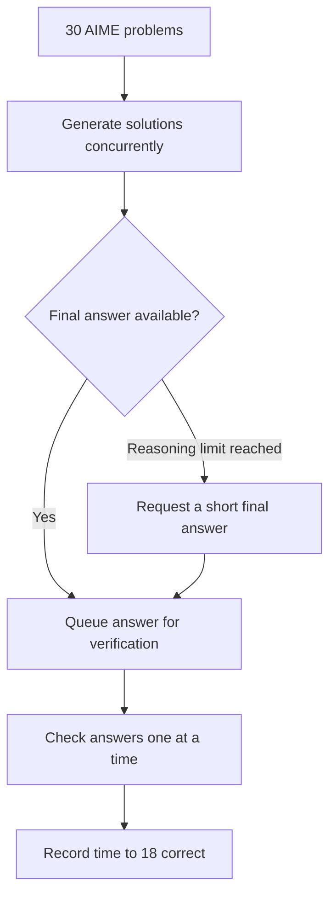

# AIME speedrun

[Report (PDF, 3 pages)](report.pdf)

Start the model and a fresh organizer-supplied grader first. See [setup](docs/reproduction.md).

```bash
python -m pip install -r requirements.txt

# Selected prompt
python run.py answer-first --questions questions.jsonl --output experiments/candidate

# Baseline: run separately, after restarting the model and grader
python run.py baseline --questions questions.jsonl --output experiments/baseline
```



```bash
# Local tests and recorded-evidence audit
python -m unittest discover -s tests
python scripts/review_results.py
```
